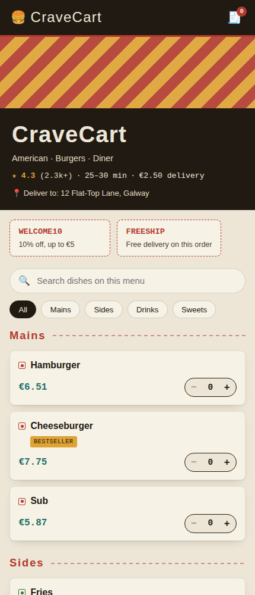

# 🍔 CraveCart

A scoped-down Swiggy/Zomato-style ordering flow — restaurant page, search & filters, cart, live-ish order tracking — built as a static, dependency-free web app. Started as a Python/Jupyter cart notebook; this is that same data model and logic, rebuilt as a small single-page app.

**[Live demo →](#deploying-to-github-pages)** *(add your GitHub Pages link here once deployed)*



## What it does

- **Home** — restaurant header (rating, ETA, delivery fee), an offers rail, dish search, category filter chips, and the menu itself, grouped by category with veg/non-veg markers and bestseller/popular badges
- **Cart** — delivery address picker, per-item quantity editing, a coupon code field (`WELCOME10`, `FREESHIP`), and a live bill breakdown rendered as a diner ticket (item total, delivery fee, tax, discount, total)
- **Order tracking** — a status stepper (Placed → Preparing → Out for delivery → Delivered) that advances on its own over a short demo timeline, with a moving rider icon and a rating prompt once delivered
- A sticky cart bar appears on the menu the moment you add something, the header cart badge stays in sync everywhere, and "Start a new order" resets state cleanly

Everything the original notebook's console loop did — `add_to_cart`, `remove_from_cart`, `modify_cart`, `view_cart`, `checkout` — maps onto this, plus the surrounding flow (browse → cart → track) a real ordering app needs.

## Tech

Plain HTML/CSS/JS — no framework, no build step, no backend. State is a small in-memory store with pub/sub (`js/cart.js`); a minimal hash router (`js/router.js`) switches between three views and calls each view's cleanup function on navigation, so subscriptions and timers don't leak between screens. Nothing is written to storage or sent anywhere — state resets on reload, same as this being a front-end-only demo.

```
cravecart/
├── index.html            # app shell: persistent header + view outlet
├── style.css              # design tokens + all styles
├── js/
│   ├── data.js              # menu, restaurant info, coupons — content only
│   ├── cart.js               # cart/order state, bill math, pub-sub store
│   ├── router.js              # hash router with per-view cleanup
│   ├── app.js                  # wires the header + routes, boots the app
│   └── views/
│       ├── home.js               # restaurant page: search, filters, menu
│       ├── cartView.js            # address, coupon, bill
│       └── trackingView.js         # order status stepper
└── README.md
```

## Running it locally

This uses ES modules, so it needs to be served over HTTP rather than opened directly as a `file://` URL:

```bash
python3 -m http.server 8000
# then visit http://localhost:8000
```

(Any static server works — `npx serve`, VS Code's Live Server, etc.)

## Deploying to GitHub Pages

1. Push this folder to a GitHub repository.
2. In the repo, go to **Settings → Pages**.
3. Under **Build and deployment**, set **Source** to `Deploy from a branch`, pick your default branch and the `/ (root)` folder.
4. Save — GitHub will publish at `https://<your-username>.github.io/<repo-name>/`.

No build step is required.

## Customizing

- **Menu items, restaurant info, coupons** — all in `js/data.js`. Each menu entry has `name`, `price`, `category`, `veg`, and `tags` (`bestseller` / `popular`), so the board and badges update automatically.
- **Tax rate, delivery fee, free-delivery threshold** — `RESTAURANT` in `js/data.js` and `TAX_RATE` in `js/cart.js`.
- **Order tracking speed** — `stepDurationMs` in `js/cart.js` controls how fast the demo stages advance.
- **Colors / fonts** — CSS custom properties at the top of `style.css` (`:root`).
- **Adding a view** — register a new route in `js/app.js` with `registerRoute("#/path", renderFn)`; `renderFn` can return a cleanup callback (unsubscribe, clear timers) that the router runs automatically on the next navigation.

## Notes on scope

This intentionally stays single-restaurant rather than a full multi-restaurant marketplace — no restaurant listing/search-by-cuisine, no real payments, no backend or persistence. It's meant to demonstrate the ordering *flow* (browse → cart → track) at a scale that's still easy to read end to end in a few files.

## Origin

Originally a console-based Python notebook (`Basics.ipynb`) using nested dictionaries for the menu and cart, with a text-based action menu loop (`add_to_cart`, `remove_from_cart`, `modify_cart`, `view_cart`, `checkout`). This version keeps that same data model and logic, translated into a client-side app with a real interface and a delivery-app flow around it.
