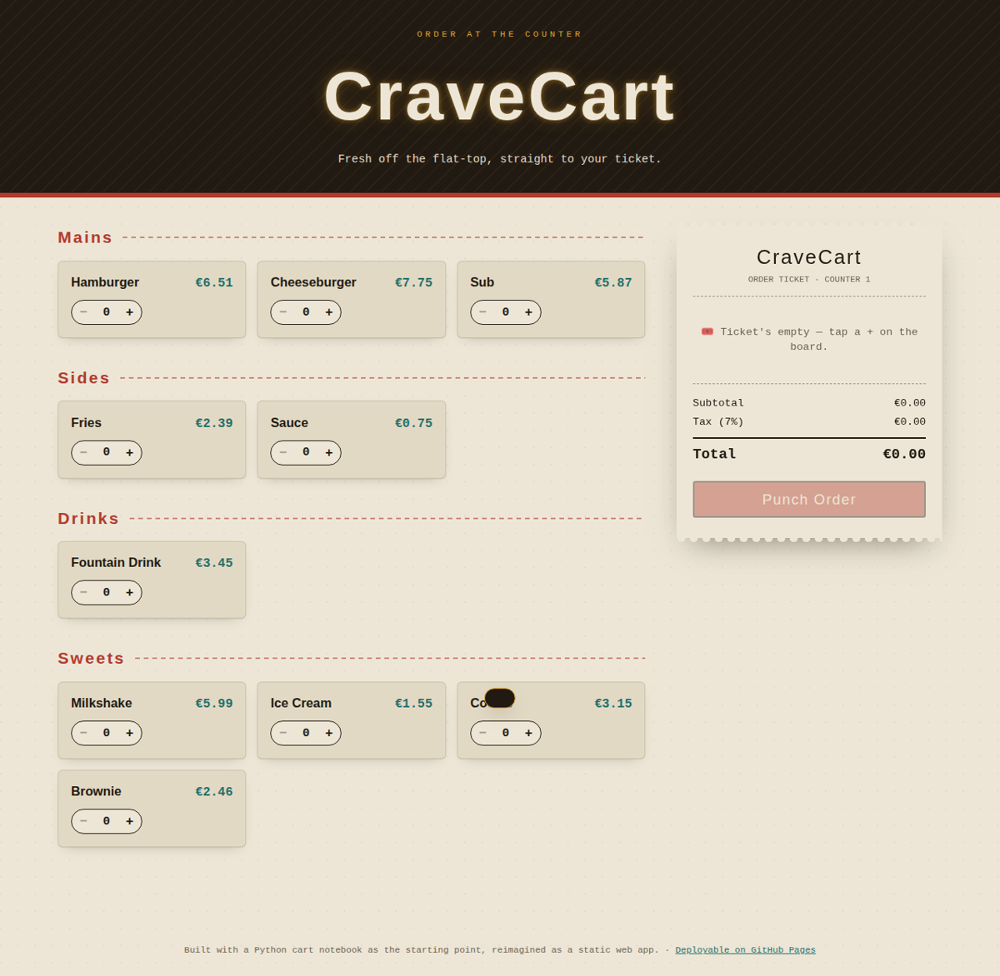

# 🍔 CraveCart

A diner-counter ordering app, reimagined from a Python/Jupyter cart notebook into a static web app. Order lands on a live "printed" ticket, complete with a PAID stamp on checkout.

**[Live demo →](#deploying-to-github-pages)** *(add your GitHub Pages link here once deployed)*



## What it does

Everything the original notebook's console loop did (`add_to_cart`, `remove_from_cart`, `modify_cart`, `view_cart`, `checkout`), now as a UI:

- Browse the menu by category (Mains, Sides, Drinks, Sweets)
- Adjust quantity per item with a +/− stepper — this doubles as add, remove, and modify
- Watch the ticket update live, with subtotal, 7% tax, and total
- Remove a single line straight from the ticket
- Clear the whole ticket
- "Punch Order" to check out — stamps the ticket and resets it for the next order

## Tech

Plain HTML/CSS/JS. No build step, no framework, no backend — just three files. Cart state lives in memory for the session (nothing is written to storage or sent anywhere), same as a register that starts blank each time it's opened.

```
cravecart/
├── index.html      # markup
├── style.css        # design tokens + styles
├── script.js         # menu data, cart logic, rendering
└── README.md
```

## Running it locally

Just open `index.html` in a browser — or serve it so relative paths behave consistently:

```bash
python3 -m http.server 8000
# then visit http://localhost:8000
```

## Deploying to GitHub Pages

1. Push this folder to a GitHub repository.
2. In the repo, go to **Settings → Pages**.
3. Under **Build and deployment**, set **Source** to `Deploy from a branch`, pick your default branch and the `/ (root)` folder.
4. Save — GitHub will publish at `https://<your-username>.github.io/<repo-name>/`.

No build step is required since this is a static site.

## Customizing

- **Menu items / prices** — edit the `MENU` object at the top of `script.js`. Each entry needs a `name`, `price`, and `category`; categories are grouped automatically on the board.
- **Tax rate** — change `SALES_TAX` in `script.js`.
- **Colors / fonts** — all design tokens are CSS custom properties at the top of `style.css` (`:root`), so retheming doesn't require touching layout rules.
- **Add new actions** (e.g. saved orders, order history) — the cart state and rendering are intentionally separated (`cart` object vs. `renderTicket()`/`renderMenu()`), so new behavior can hook in by mutating `cart` and calling the relevant render function.

## Origin

This started as a console-based Python notebook (`Basics.ipynb`) using nested dictionaries for the menu and cart, with a text-based action menu loop. This version keeps the same data model and logic, translated into a client-side app with a real interface.
